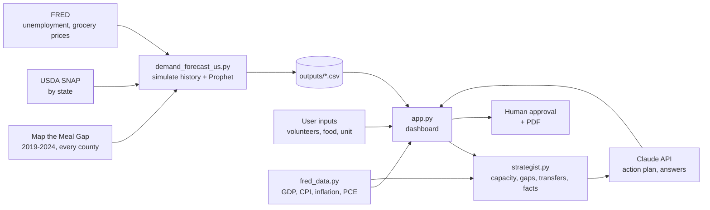

# Architecture

PantryPulse has two stages: an **offline forecast build** (`demand_forecast_us.py`) that writes CSV files, and an **interactive dashboard** (`app.py`) that reads those files, recalculates capacity live, and calls Claude and FRED.

## Components

| File | Role | Runs when |
|---|---|---|
| `demand_forecast_us.py` | Loads real data, simulates weekly history, fits Prophet models, backtests, writes forecasts and alerts | Once, before the demo (and whenever data changes) |
| `fred_data.py` | Downloads FRED series, caches them, summarizes indicators | Imported by the app (the forecast script has its own FRED loader) |
| `strategist.py` | Capacity math, transfers, the "facts" sent to Claude, Claude API calls, rule-based fallbacks, PDF export, API key loading | Imported by the app |
| `app.py` | Streamlit dashboard: County forecast, AI action plan, Economy (FRED) | `streamlit run app.py` |

## Data flow

## The pipeline in six steps

1. **Real data**: need for every county, SNAP change by state, economic data from FRED.
2. **Forecast**: households per week, 8 weeks ahead, with a range (Prophet).
3. **Capacity check**: volunteers and food compared to the forecast separately.
4. **Gap**: converted to volunteer shifts, food, meals, and dollars.
5. **AI action plan**: Claude ranks actions, assigns owners and deadlines, drafts outreach.
6. **Human approval**: a person approves; nothing is sent automatically.

## Design principles

**1. Python does the math, Claude does the strategy, people decide.**
Every number (gaps, shifts, food, meals, dollars, transfers) is computed in Python. Claude receives those numbers as structured "facts" and is instructed never to invent or estimate figures. Language models reason and write well but can make arithmetic mistakes; here a wrong number means families without food or wasted donations.

**2. Demand and capacity are kept separate.**
The forecast depends only on the community (need, seasons, school breaks, SNAP, economy). The sliders change capacity only. The gap between them drives every alert and action. This is why moving a slider never moves the forecast line.

**3. Plan for the bad case.**
Alerts use the high end of the forecast range, because running out of food is worse than having a few extra volunteers.

**4. Ask only for what is short.**
Volunteers and food are checked separately, so the tool never asks for food a food bank already has (or volunteers it doesn't need).

**5. Never break during operations.**
Without a Claude key, plans and answers come from rules using the same numbers. Without a FRED key or internet, cached data is used, or economic factors are simply turned off. Without a PDF library, the app says what to install.

**6. Honest by default.**
The dashboard labels simulated data, shows what the AI sees ("What the AI sees" expander), and reports model accuracy against a simple baseline.

## Why two stages?

Fitting ~130 Prophet models takes 1-3 minutes, too slow for a live dashboard. The forecast is built once; the app recalculates capacity, gaps, and plans instantly as users move sliders.
